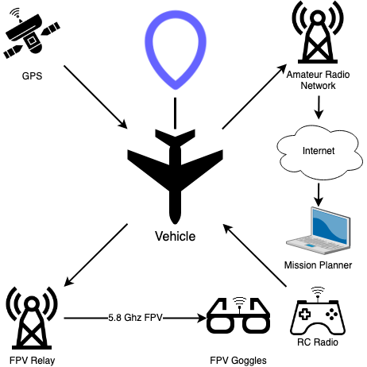

# Operation Whale Drop

Operation Whale Drop is a high altitude balloon (HAB) mission to drop a RC-controlled, fixed-wing vehicle from a
stratospheric altitude and return it to the launch area.



```{tableofcontents}
```
