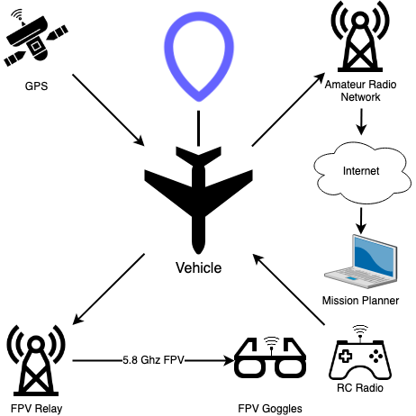

# Operation Whale Drop

Operation Whale Drop is a high altitude balloon (HAB) mission to drop a RC-controlled, fixed-wing vehicle from a
stratospheric altitude and return it to the launch area.

## Links

1. [Github source](https://github.com/sea7aero/sprite-1)
1. [Youtube videos](https://youtube.com/playlist?list=PLEpeG0_A0TaUCREN44DacQHggu0m4HloI)